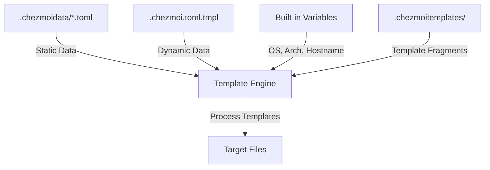

# Architecture Patterns for chezmoi + mise Dotfiles Migration

## Executive Summary

This document outlines the architecture for migrating from Dotbot + Nix to chezmoi + mise for dotfiles management. The migration preserves the current modular structure while adopting chezmoi's file-based approach (replacing symlinks) and mise for tool version management.

**Key Architectural Decisions:**
- **Source Directory**: `~/.local/share/chezmoi` (chezmoi default)
- **Target Directory**: `~` (user home directory)
- **Machine Configuration**: `.chezmoidata/*.toml` for static data, `.chezmoi.toml.tmpl` for dynamic
- **Package Management**: `run_onchange_` scripts with embedded Brewfiles
- **Tool Versions**: Global mise config in `~/.config/mise/config.toml`

## Recommended Directory Structure

Based on [chezmoi's architecture documentation](https://www.chezmoi.io/developer-guide/architecture/) and [best practices](https://www.chezmoi.io/user-guide/advanced/customize-your-source-directory/), here's the proposed source directory layout:

```
~/.local/share/chezmoi/
├── .chezmoi.toml.tmpl              # Dynamic machine config (hostname, OS detection)
├── .chezmoiignore                  # Files to exclude from target
├── .chezmoiroot                    # Optional: specify subdirectory as root
│
├── .chezmoidata/                   # Static configuration data
│   ├── packages.toml               # Package declarations (common)
│   ├── packages_client.toml        # Client-specific packages
│   └── packages_fanaka.toml        # Fanaka-specific packages
│
├── .chezmoiscripts/                # Reusable script libraries
│   └── install-helpers.sh          # Common installation functions
│
├── .chezmoitemplates/              # Template fragments
│   ├── brewfile.tmpl               # Reusable Brewfile template
│   └── zsh-header.tmpl             # Common ZSH file headers
│
├── run_once_before_00-install-homebrew.sh    # One-time Homebrew installation
├── run_once_before_01-install-mise.sh        # One-time mise installation
├── run_onchange_before_install-packages.sh.tmpl  # Package installation (runs on changes)
│
├── dot_zshrc.tmpl                  # ~/.zshrc (templated for machine-specific vars)
├── dot_zshenv                      # ~/.zshenv (static)
├── dot_zprofile                    # ~/.zprofile (static)
│
├── dot_zsh.d/                      # ~/.zsh.d/ (modular shell config)
│   ├── aliases.zsh                 # Static file
│   ├── functions.zsh               # Static file
│   ├── variables.zsh.tmpl          # Templated for machine-specific values
│   ├── path.zsh.tmpl               # Templated for different paths
│   ├── atuin.zsh                   # Static file
│   ├── carapace.zsh                # Static file
│   ├── completions.zsh             # Static file
│   ├── external.zsh                # Static file
│   ├── hooks.zsh                   # Static file
│   ├── keybinds.zsh                # Static file
│   ├── ssh.zsh                     # Static file
│   ├── wt.zsh                      # Static file
│   ├── xlaude.zsh                  # Static file
│   ├── intelli-shell.zsh           # Static file
│   └── lens-completion.zsh         # Static file
│
├── dot_config/                     # ~/.config/ directory
│   ├── mise/
│   │   └── config.toml.tmpl        # Global mise configuration (templated)
│   │
│   ├── aerospace/
│   │   └── aerospace.toml          # Static config
│   │
│   ├── atuin/
│   │   ├── config.toml.tmpl        # Templated for sync settings
│   │   └── private_key             # Use encrypted_ prefix for secrets
│   │
│   ├── bat/
│   │   └── config                  # Static config
│   │
│   ├── btop/
│   │   └── btop.conf               # Static config
│   │
│   ├── claude/
│   │   ├── CLAUDE.md               # Static config
│   │   ├── settings.json           # Static config
│   │   ├── agents/                 # Directory
│   │   ├── commands/               # Directory
│   │   └── skills/                 # Directory
│   │
│   ├── git/
│   │   ├── gitconfig.tmpl          # Templated for name/email
│   │   ├── gitignore               # Static
│   │   └── gitattributes           # Static
│   │
│   ├── ghostty/
│   │   └── config                  # Static config
│   │
│   ├── karabiner/
│   │   └── karabiner.json          # Static config
│   │
│   ├── kitty/
│   │   └── kitty.conf              # Static config (currently .config/kitty.conf)
│   │
│   ├── lazygit/
│   │   └── config.yml              # Static config (currently lazygit.yml)
│   │
│   ├── lsd/
│   │   └── config.yaml             # Static config
│   │
│   ├── nushell/                    # Directory
│   │   └── (nushell configs)
│   │
│   ├── zsh-abbr/
│   │   └── user-abbreviations      # Static config
│   │
│   └── zgenom/
│       └── zgenomrc.zsh            # Static config
│
├── dot_hushlogin                   # ~/.hushlogin
├── dot_inputrc                     # ~/.inputrc
├── dot_wezterm.lua                 # ~/.wezterm.lua
├── dot_editorconfig                # ~/.editorconfig
├── dot_nanorc                      # ~/.nanorc
├── dot_psqlrc                      # ~/.psqlrc
├── dot_sqliterc                    # ~/.sqliterc
├── dot_aider.conf.yml              # ~/.aider.conf.yml
├── dot_finicky.js                  # ~/.finicky.js
├── dot_gitconfig -> dot_config/git/gitconfig.tmpl  # Symlink in source
│
├── dot_gnupg/
│   └── gpg-agent.conf              # ~/.gnupg/gpg-agent.conf
│
├── zgenom/                         # ~/.zgenom (external directory)
│   └── (zgenom content)
│
└── nvim/                           # ~/.config/nvim (external directory)
    └── (nvim config)
```

### File Naming Conventions

As documented in [chezmoi's source state attributes](https://www.chezmoi.io/reference/source-state-attributes/):

- `dot_` prefix → `.` in target (e.g., `dot_zshrc` → `~/.zshrc`)
- `.tmpl` suffix → File processed as template
- `executable_` prefix → File gets executable permissions
- `private_` prefix → File gets 0600 permissions
- `readonly_` prefix → File gets read-only permissions
- `encrypted_` prefix → File stored encrypted (for secrets)
- `run_once_` prefix → Script runs once successfully
- `run_onchange_` prefix → Script runs when contents change
- `before_`/`after_` modifiers → Control script execution order

## Template Organisation

### Static vs Templated Files Decision Tree

Based on [chezmoi's templating guide](https://www.chezmoi.io/user-guide/templating/):

```
Does file contain machine-specific values?
├─ YES → Use .tmpl suffix
│   ├─ Examples: .zshrc, git config, mise config
│   ├─ Access data via {{ .variableName }}
│   └─ Can use conditionals: {{ if eq .chezmoi.os "darwin" }}
│
└─ NO → Keep as static file
    ├─ Examples: aliases.zsh, bat config, static tool configs
    └─ Faster processing, simpler maintenance
```

### Template Categories

**1. Static Files** (no .tmpl suffix)
- Pure configuration with no machine-specific values
- Shell aliases, functions (unless machine-specific paths)
- Tool configurations that are identical across machines
- Examples: `dot_zsh.d/aliases.zsh`, `dot_config/bat/config`

**2. Templated Files** (.tmpl suffix)
- Files with machine-specific paths, hostnames, or credentials
- Conditional content based on OS or hostname
- Files using data from `.chezmoidata/`
- Examples: `dot_zshrc.tmpl`, `dot_config/git/gitconfig.tmpl`

**3. Template Fragments** (.chezmoitemplates/)
- Reusable template snippets included in multiple files
- Common headers, footers, or configuration blocks
- Accessed via `{{ template "brewfile.tmpl" . }}`
- Examples: Brewfile template, common script headers

### Template Data Flow

According to [chezmoi's data sources documentation](https://www.chezmoi.io/reference/special-directories/chezmoidata/):



**Data Sources Priority:**
1. Built-in variables (`{{ .chezmoi.os }}`, `{{ .chezmoi.hostname }}`)
2. `.chezmoidata/` files (merged alphabetically)
3. `.chezmoi.toml.tmpl` (dynamic configuration)
4. Command-line overrides

## Machine Configuration Pattern

### Machine-Specific Data Architecture

As described in [machine-to-machine differences guide](https://www.chezmoi.io/user-guide/manage-machine-to-machine-differences/):

**Option 1: Static Data (.chezmoidata/)** - RECOMMENDED for packages

```toml
# .chezmoidata/packages.toml
[common]
brews = [
    "atuin",
    "bat",
    "bottom",
    "carapace",
    "duf",
    "dust",
    "eza",
    "fd",
    "fzf",
    "gh",
    "git",
    "git-delta",
    "lazygit",
    "lsd",
    "mise",
    "ripgrep",
    "zoxide"
]

casks = [
    "aerospace",
    "ghostty",
    "karabiner-elements"
]

# .chezmoidata/packages_client.toml
[client]
brews = [
    "argocd",
    "docker",
    "docker-compose",
    "kubernetes-cli"
]

casks = [
    "slack",
    "zoom"
]

# .chezmoidata/packages_fanaka.toml
[fanaka]
brews = [
    "postgresql@14",
    "redis"
]
```

**Option 2: Dynamic Config (.chezmoi.toml.tmpl)** - For runtime detection

```toml
{{- $hostname := .chezmoi.hostname -}}
{{- $isClient := contains "client" (lower $hostname) -}}
{{- $isFanaka := contains "fanaka" (lower $hostname) -}}

[data]
    hostname = {{ $hostname | quote }}
    isClient = {{ $isClient }}
    isFanaka = {{ $isFanaka }}

    {{- if $isClient }}
    machine_type = "client"
    {{- else if $isFanaka }}
    machine_type = "fanaka"
    {{- else }}
    machine_type = "personal"
    {{- end }}

    [data.paths]
    {{- if eq .chezmoi.os "darwin" }}
    homebrew = "/opt/homebrew"
    {{- else }}
    homebrew = "/home/linuxbrew/.linuxbrew"
    {{- end }}
```

### Machine Type Detection Pattern

```zsh
# In dot_zshrc.tmpl
{{- if eq .machine_type "client" }}
# Client-specific configurations
export CLIENT_MODE=1
{{- else if eq .machine_type "fanaka" }}
# Fanaka-specific configurations
export FANAKA_MODE=1
{{- end }}

# Common configurations for all machines
export EDITOR="{{ .editor | default "nvim" }}"
```

## Script Organisation

### Script Execution Order

Following [chezmoi's script usage guide](https://www.chezmoi.io/user-guide/use-scripts-to-perform-actions/):

```
Execution Flow:
1. run_once_before_* (alphabetically)
   → run_once_before_00-install-homebrew.sh
   → run_once_before_01-install-mise.sh

2. Apply file changes
   → Create/update dotfiles

3. run_onchange_before_* (if content changed)
   → run_onchange_before_install-packages.sh.tmpl

4. run_after_* (alphabetically)
   → run_after_reload-shell.sh

5. run_once_after_* (alphabetically)
   → run_once_after_setup-complete.sh
```

### Package Installation Scripts

**1. Homebrew Bootstrap** (`run_once_before_00-install-homebrew.sh`)

```bash
#!/bin/bash
set -euo pipefail

# Check if Homebrew is already installed
if command -v brew &> /dev/null; then
    echo "Homebrew already installed"
    exit 0
fi

# Install Homebrew
/bin/bash -c "$(curl -fsSL https://raw.githubusercontent.com/Homebrew/install/HEAD/install.sh)"

# Set up Homebrew in PATH for current session
if [[ "$(uname -m)" == "arm64" ]]; then
    eval "$(/opt/homebrew/bin/brew shellenv)"
else
    eval "$(/usr/local/bin/brew shellenv)"
fi

echo "Homebrew installed successfully"
```

**2. mise Installation** (`run_once_before_01-install-mise.sh`)

According to [mise documentation](https://mise.jdx.dev/getting-started.html):

```bash
#!/bin/bash
set -euo pipefail

if command -v mise &> /dev/null; then
    echo "mise already installed"
    exit 0
fi

# Install mise via Homebrew (already installed in previous step)
brew install mise

echo "mise installed successfully"
```

**3. Package Installation** (`run_onchange_before_install-packages.sh.tmpl`)

Using the [declarative package pattern](https://www.chezmoi.io/user-guide/advanced/install-packages-declaratively/):

```bash
#!/bin/bash
set -euo pipefail

# This script runs whenever package lists change
# It uses data from .chezmoidata/packages*.toml

echo "Installing Homebrew packages..."

# Create temporary Brewfile from template
cat > /tmp/Brewfile << 'EOF'
{{ range .common.brews -}}
brew {{ . | quote }}
{{ end -}}

{{ range .common.casks -}}
cask {{ . | quote }}
{{ end -}}

{{- if .isClient }}
# Client-specific packages
{{ range .client.brews -}}
brew {{ . | quote }}
{{ end -}}
{{ range .client.casks -}}
cask {{ . | quote }}
{{ end -}}
{{- end }}

{{- if .isFanaka }}
# Fanaka-specific packages
{{ range .fanaka.brews -}}
brew {{ . | quote }}
{{ end -}}
{{ range .fanaka.casks -}}
cask {{ . | quote }}
{{ end -}}
{{- end }}
EOF

# Install packages using Brewfile
brew bundle --no-lock --file=/tmp/Brewfile

# Clean up
rm /tmp/Brewfile

echo "Package installation complete"
```

### Script Best Practices

As noted in [chezmoi's script documentation](https://www.chezmoi.io/user-guide/use-scripts-to-perform-actions/):

1. **Idempotency**: All scripts should be idempotent (safe to run multiple times)
2. **Error Handling**: Use `set -euo pipefail` for bash scripts
3. **Naming**: Use numeric prefixes for execution order (00, 01, 02...)
4. **Templates**: Use `.tmpl` suffix when script needs data from chezmoi
5. **State**: chezmoi tracks script execution in persistent state

## mise Configuration Integration

### Global mise Config Structure

Based on [mise configuration documentation](https://mise.jdx.dev/configuration.html):

**File Location**: `~/.config/mise/config.toml` (managed by chezmoi as `dot_config/mise/config.toml.tmpl`)

```toml
# dot_config/mise/config.toml.tmpl
# Global tool versions and settings

[tools]
# Core development tools
node = "lts"              # Use LTS version
python = "3.12"
ruby = "3.3"

{{- if .isClient }}
# Client-specific tool versions
terraform = "1.9"
kubectl = "1.30"
{{- end }}

{{- if .isFanaka }}
# Fanaka-specific tool versions
postgresql = "14"
{{- end }}

[settings]
experimental = true
verbose = false
jobs = 4                  # Parallel installation jobs

{{- if eq .chezmoi.os "darwin" }}
# macOS-specific settings
legacy_version_file = true
plugin_autoupdate_last_check_duration = "7d"
{{- end }}

[aliases]
# Convenient aliases for versions
node.lts = "lts-latest"
python.stable = "3.12"
```

### mise Integration with Shell

In `dot_zshrc.tmpl`:

```zsh
# Initialise mise (replaces asdf)
if command -v mise &> /dev/null; then
    eval "$(mise activate zsh)"
fi
```

### Project-Level mise Config

mise also supports project-level configuration (not managed by chezmoi):

```toml
# Project: ~/projects/my-app/.mise.toml
[tools]
node = "20.11.0"
python = "3.11"

[env]
NODE_ENV = "development"
```

## Migration Order

### Phase 1: Preparation (Pre-Migration)

**Research Complete** ✓
- [x] Document architecture patterns
- [x] Review chezmoi documentation
- [x] Plan directory structure

**Next Steps:**

1. **Audit Current State**
   ```bash
   # Document all current symlinks
   cd ~/.dotfiles
   find . -type l > /tmp/current-symlinks.txt

   # List all configuration files
   find .config -type f > /tmp/current-configs.txt
   ```

2. **Backup Current Setup**
   ```bash
   # Create backup
   tar -czf ~/dotfiles-backup-$(date +%Y%m%d).tar.gz ~/.dotfiles

   # Backup live configs
   tar -czf ~/home-configs-backup-$(date +%Y%m%d).tar.gz \
     ~/.zshrc ~/.zshenv ~/.zprofile ~/.config
   ```

3. **Install chezmoi**
   ```bash
   brew install chezmoi
   ```

### Phase 2: Initial Setup

1. **Initialise chezmoi Repository**
   ```bash
   # Initialise with existing dotfiles repo
   chezmoi init --apply git@github.com:sleicht/dotfiles-zsh.git
   ```

2. **Create Base Structure**
   ```bash
   cd ~/.local/share/chezmoi

   # Create special directories
   mkdir -p .chezmoidata
   mkdir -p .chezmoiscripts
   mkdir -p .chezmoitemplates

   # Create base config files
   touch .chezmoi.toml.tmpl
   touch .chezmoiignore
   ```

3. **Add Machine Configuration**
   - Create `.chezmoi.toml.tmpl` with hostname detection
   - Create `.chezmoidata/packages.toml` with common packages
   - Create machine-specific package files

### Phase 3: Migration (File by File)

**Order of Migration:**

1. **Shell Core** (Highest Priority)
   ```bash
   # Add with --follow to dereference symlinks
   chezmoi add --follow ~/.zshrc
   chezmoi add --follow ~/.zshenv
   chezmoi add --follow ~/.zprofile

   # Convert to templates if needed
   chezmoi chattr +template ~/.zshrc

   # Migrate zsh.d/ directory
   chezmoi add --follow ~/.zsh.d
   ```

2. **Static Configs** (Medium Priority)
   ```bash
   # Add tool configs
   chezmoi add --follow ~/.config/bat/config
   chezmoi add --follow ~/.config/lsd/config.yaml
   chezmoi add --follow ~/.hushlogin
   chezmoi add --follow ~/.inputrc
   ```

3. **Templated Configs** (Medium Priority)
   ```bash
   # Add and template git config
   chezmoi add --follow ~/.gitconfig
   chezmoi chattr +template ~/.gitconfig

   # Edit template to use variables
   chezmoi edit ~/.gitconfig
   ```

4. **Tool Configurations** (Low Priority)
   ```bash
   # Add complex tool configs
   chezmoi add --follow ~/.config/nvim
   chezmoi add --follow ~/.config/atuin
   chezmoi add --follow ~/.config/claude
   ```

### Phase 4: Script Development

1. **Create Installation Scripts**
   - Write `run_once_before_00-install-homebrew.sh`
   - Write `run_once_before_01-install-mise.sh`
   - Write `run_onchange_before_install-packages.sh.tmpl`

2. **Create mise Configuration**
   ```bash
   # Add mise config
   chezmoi add ~/.config/mise/config.toml
   chezmoi chattr +template ~/.config/mise/config.toml
   ```

3. **Test Scripts**
   ```bash
   # Dry run to preview changes
   chezmoi apply --dry-run --verbose

   # Test on a VM or separate user account first
   ```

### Phase 5: Package Migration

1. **Migrate Brewfile Data**
   - Extract packages from `Brewfile`, `Brewfile_Client`, `Brewfile_Fanaka`
   - Populate `.chezmoidata/packages*.toml` files
   - Create templated installation script

2. **Remove Nix Configuration**
   ```bash
   # Document what's being removed
   ls -la nix-config/ > /tmp/nix-config-manifest.txt

   # Remove from chezmoi (after confirming packages moved to Homebrew)
   chezmoi forget nix-config/
   ```

### Phase 6: Testing & Validation

1. **Test on Clean Machine** (or VM)
   ```bash
   # Clone and apply
   chezmoi init --apply git@github.com:sleicht/dotfiles-zsh.git

   # Verify all files created
   chezmoi managed

   # Check differences
   chezmoi diff
   ```

2. **Validate Package Installation**
   ```bash
   # Check Homebrew packages
   brew list

   # Check mise tools
   mise list

   # Verify shell functions
   source ~/.zshrc
   ```

3. **Compare with Original**
   ```bash
   # Compare key files
   diff ~/.zshrc ~/.dotfiles/.config/zshrc
   diff ~/.gitconfig ~/.dotfiles/.config/git/gitconfig
   ```

### Phase 7: Finalisation

1. **Clean Up Old System**
   ```bash
   # Remove Dotbot files (after confirming everything works)
   rm ~/.dotfiles/install
   rm -rf ~/.dotfiles/steps/

   # Keep as reference initially
   mv ~/.dotfiles/Brewfile* ~/.dotfiles/archive/
   ```

2. **Update Documentation**
   - Update README.md with chezmoi instructions
   - Document machine setup process
   - Update CLAUDE.md with new structure

3. **Commit Migration**
   ```bash
   cd ~/.local/share/chezmoi
   git add .
   git commit -m "feat: migrate from Dotbot+Nix to chezmoi+mise"
   git push
   ```

## Migration Checklist

### Pre-Migration
- [ ] Read all chezmoi documentation
- [ ] Backup current dotfiles
- [ ] Backup live home directory configs
- [ ] Install chezmoi
- [ ] Test chezmoi on sample files

### Core Migration
- [ ] Create `.chezmoi.toml.tmpl` with machine detection
- [ ] Create `.chezmoidata/` package declarations
- [ ] Migrate shell configs (zshrc, zshenv, zprofile)
- [ ] Migrate `zsh.d/` modular configs
- [ ] Migrate static tool configs
- [ ] Migrate templated configs (git, mise)

### Script Development
- [ ] Create Homebrew installation script
- [ ] Create mise installation script
- [ ] Create package installation script
- [ ] Test all scripts in dry-run mode

### Package Management
- [ ] Extract packages from Brewfiles
- [ ] Populate `.chezmoidata/packages*.toml`
- [ ] Test package installation on clean system
- [ ] Remove nix-config/ directory

### Validation
- [ ] Test on clean VM/user account
- [ ] Verify all managed files applied
- [ ] Verify all packages installed
- [ ] Verify shell functions work
- [ ] Compare with original configs

### Finalisation
- [ ] Update documentation
- [ ] Remove Dotbot files
- [ ] Archive old Brewfiles
- [ ] Commit and push changes
- [ ] Update repository README

## Key Differences from Current Setup

| Aspect | Current (Dotbot) | New (chezmoi) |
|--------|------------------|---------------|
| File Storage | Symlinks to repo | Files copied to home |
| Config Location | `~/.dotfiles` | `~/.local/share/chezmoi` |
| Symlink Method | Explicit in `terminal.yml` | Not used (files copied) |
| Machine-Specific | Separate Brewfiles | `.chezmoidata/*.toml` |
| Package Install | Manual `brew bundle` | Automatic via `run_onchange_` |
| Tool Versions | Nix + asdf | mise only |
| Templating | None (static files) | Go templates with conditionals |
| State Tracking | None | chezmoi persistent state |

## Benefits of New Architecture

1. **No Symlinks**: Files exist directly in home directory (cleaner, fewer edge cases)
2. **Templating**: Machine-specific values without file duplication
3. **Automatic Installation**: Scripts run when configs change
4. **State Tracking**: chezmoi knows what's been applied/run
5. **Better Secrets**: Encrypted file support for sensitive data
6. **Tool Versioning**: mise replaces both asdf and Nix for simpler setup
7. **Portability**: Works on any Unix system (not just macOS)

## Recommended Reading

### Essential Documentation
- [chezmoi Quick Start](https://www.chezmoi.io/quick-start/) - Get started guide
- [chezmoi Architecture](https://www.chezmoi.io/developer-guide/architecture/) - How chezmoi works
- [Manage Machine Differences](https://www.chezmoi.io/user-guide/manage-machine-to-machine-differences/) - Machine-specific configs
- [Use Scripts](https://www.chezmoi.io/user-guide/use-scripts-to-perform-actions/) - Script execution
- [Install Packages Declaratively](https://www.chezmoi.io/user-guide/advanced/install-packages-declaratively/) - Package management
- [Templating Guide](https://www.chezmoi.io/user-guide/templating/) - Template syntax
- [macOS Guide](https://www.chezmoi.io/user-guide/machines/macos/) - macOS-specific patterns
- [Migrating from Another Manager](https://www.chezmoi.io/migrating-from-another-dotfile-manager/) - Migration strategies
- [mise Configuration](https://mise.jdx.dev/configuration.html) - mise setup

### Real-World Examples
- [shunk031/dotfiles](https://github.com/shunk031/dotfiles) - Well-structured chezmoi setup
- [How To Manage Dotfiles With Chezmoi](https://jerrynsh.com/how-to-manage-dotfiles-with-chezmoi/) - Tutorial
- [Managing dotfiles with Chezmoi](https://natelandau.com/managing-dotfiles-with-chezmoi/) - Practical guide

## Next Steps

1. Review this architecture document
2. Proceed to Phase 1: Preparation
3. Create detailed migration plan for specific files
4. Begin incremental migration (shell configs first)
5. Test thoroughly before removing old system

## Notes

- Keep both systems running in parallel during migration for safety
- Test each phase on a VM or secondary machine first
- Document any issues or deviations from this plan
- Update this document as patterns emerge during migration
