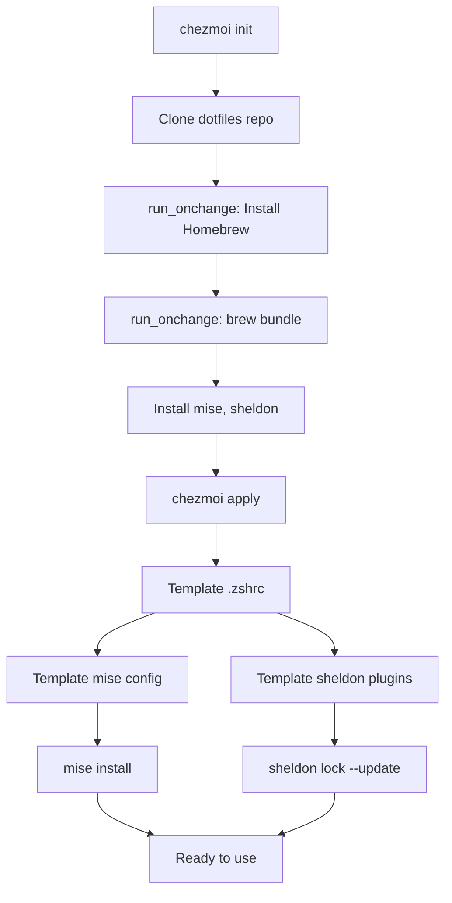

# Stack Analysis: chezmoi + mise Migration

**Research Date:** 2026-01-25
**Context:** Migration from Nix/Dotbot/Zgenom/asdf to chezmoi/mise/Homebrew/Sheldon
**Target Platforms:** macOS + Linux (cross-platform support)

---

## Executive Summary

This research covers the recommended 2025 technology stack for managing dotfiles with chezmoi and mise. Both tools have matured significantly and offer robust cross-platform support with excellent performance characteristics. The combination provides a modern, fast, and maintainable approach to dotfile management.

---

## Recommended Versions

### chezmoi

**Version:** 2.69.3 (Latest stable as of January 2025)

**Why:** This is the most recent stable release with full feature set for cross-platform dotfile management. chezmoi is actively maintained with regular releases.

**Installation:**
```bash
# via Homebrew (macOS/Linux)
brew install chezmoi

# via mise (recommended for version pinning)
mise use --global chezmoi@2.69.3
```

**Sources:**
- [chezmoi Release History](https://www.chezmoi.io/reference/release-history/)
- [Install chezmoi](https://www.chezmoi.io/install/)

### mise

**Version:** 2026.1.6 (Latest as of 2026-01-21)

**Why:** mise represents a significant evolution from asdf, written in Rust for superior performance. It's backward compatible with asdf plugins and .tool-versions files, making migration straightforward. Recent versions (2025.12.x and 2026.1.x) include stable task runner features and improved lockfile support.

**Installation:**
```bash
# via Homebrew
brew install mise

# Activate in shell (add to .zshrc)
eval "$(mise activate zsh)"
```

**Sources:**
- [mise Documentation](https://mise.jdx.dev/)
- [mise Releases](https://github.com/jdx/mise/releases)

### Homebrew

**Current Status:** Latest version auto-updates

**Why:** Homebrew remains the de facto package manager for macOS and has excellent Linux support. Use `brew bundle` for declarative package management.

### Sheldon

**Version:** 0.4.3+ (Latest stable)

**Why:** Sheldon is a fast, Rust-based shell plugin manager with TOML configuration. It's significantly faster than traditional zsh plugin managers and integrates cleanly with chezmoi.

**Sources:**
- [Sheldon GitHub](https://github.com/rossmacarthur/sheldon)

---

## chezmoi Configuration

### Core Configuration Principles

**1. Use Configuration Templates**

Create a config template with `chezmoi edit-config-template` to make replicating your setup to new machines easier. The template will be part of your Git repo.

**Location:** `~/.config/chezmoi/chezmoi.toml` (or .json, .yaml)

**Example Configuration:**
```toml
[data]
    email = "user@example.com"

[git]
    autoCommit = true
    autoPush = false  # Set to false if repo is public to prevent accidental secret exposure

[edit]
    apply = true  # Auto-apply changes after edit

[diff]
    pager = "delta"
```

**Why:**
- `autoCommit = true`: Keeps changes synchronized in Git automatically
- `autoPush = false`: Prevents accidental exposure of secrets in public repos (enable only for private repos)
- `apply = true`: Streamlines workflow by applying changes immediately after editing

**Sources:**
- [chezmoi Configuration File](https://www.chezmoi.io/reference/configuration-file/)
- [Managing dotfiles with Chezmoi](https://natelandau.com/managing-dotfiles-with-chezmoi/)

### Cross-Platform Template Strategy

**2. OS-Specific Conditionals**

Use chezmoi's built-in template variables for cross-platform compatibility:

```bash
{{ if eq .chezmoi.os "darwin" -}}
# macOS-specific configuration
export BROWSER="open"
{{ else if eq .chezmoi.os "linux" -}}
# Linux-specific configuration
export BROWSER="xdg-open"
{{ end -}}
```

**Available Variables:**
- `.chezmoi.os`: Operating system (darwin, linux, etc.)
- `.chezmoi.osRelease`: Linux distribution info
- `.chezmoi.arch`: CPU architecture
- `.chezmoi.hostname`: Machine hostname

**Why:** This approach keeps a single source of truth while allowing OS-specific variations.

**3. File Organization Patterns**

```
~/.local/share/chezmoi/
├── .chezmoi.toml.tmpl              # Configuration template
├── .chezmoiignore                  # Ignore patterns (OS-specific)
├── .chezmoitemplates/              # Shared template snippets
│   └── common-shell.tmpl
├── dot_zshrc.tmpl                  # Cross-platform .zshrc
├── dot_config/
│   ├── sheldon/
│   │   └── plugins.toml.tmpl
│   └── mise/
│       └── config.toml.tmpl
├── run_onchange_before_install-packages-darwin.sh.tmpl
└── run_onchange_before_install-packages-linux.sh.tmpl
```

**Why:**
- `.tmpl` extension: Files are processed as templates
- `.chezmoitemplates/`: Reusable snippets across multiple files
- `run_onchange_`: Scripts that re-run when contents change
- `run_once_`: Scripts that run only once

**4. Security and Secrets Management**

**Recommended Approach:** Use encrypted files or password manager integration

```toml
[encryption]
    type = "gpg"
    recipient = "your-key-id"
```

**Why:** Never commit plain-text secrets. chezmoi supports:
- GPG encryption
- age encryption
- Password manager integration (1Password, Bitwarden, etc.)
- Private configuration files (`.chezmoi.local.toml`)

**Sources:**
- [Manage machine-to-machine differences](https://www.chezmoi.io/user-guide/manage-machine-to-machine-differences/)
- [Cross-Platform Dotfiles with Chezmoi](https://alfonsofortunato.com/posts/dotfile/)

### Homebrew Integration

**5. Declarative Package Installation**

Create `run_onchange_` scripts for automatic package installation:

**Example: `run_onchange_before_install-packages-darwin.sh.tmpl`**
```bash
#!/bin/bash

set -eufo pipefail

{{ if eq .chezmoi.os "darwin" -}}
brew bundle --no-lock --file=/dev/stdin <<EOF
# CLI Tools
brew "git"
brew "mise"
brew "sheldon"
brew "chezmoi"

# Casks
cask "firefox"
EOF
{{ end -}}
```

**Why:**
- `run_onchange_`: Re-runs when Brewfile contents change (when you add/remove packages)
- `--no-lock`: Prevents lockfile creation in temp location
- `--file=/dev/stdin`: Accepts Brewfile from stdin (embedded in script)
- Template conditional: Only runs on macOS

**Alternative Approach:** External Brewfile
```bash
{{ if eq .chezmoi.os "darwin" -}}
brew bundle --file={{ .chezmoi.sourceDir }}/Brewfile
{{ end -}}
```

**Sources:**
- [macOS - chezmoi](https://www.chezmoi.io/user-guide/machines/macos/)
- [Install packages declaratively](https://www.chezmoi.io/user-guide/advanced/install-packages-declaratively/)

---

## mise Configuration

### Core Configuration Strategy

**1. Global vs. Local Configuration**

**Global Config:** `~/.config/mise/config.toml`
```toml
[tools]
# Global tools available everywhere
node = "lts"
python = ["3.11", "3.12"]
go = "latest"

[settings]
# Enable automatic installation when .mise.toml is found
not_found_auto_install = true

# Support other version managers' files
idiomatic_version_file_enable_tools = ["node"]  # Read .nvmrc

# Task runner settings
task_output = "prefix"

# Experimental features (stable in 2025+)
experimental = true
```

**Project Config:** `mise.toml` (project root)
```toml
[tools]
node = "22"
python = "3.12"

[env]
DATABASE_URL = "postgresql://localhost/mydb"
PATH = ["./node_modules/.bin", "$PATH"]
```

**Why:**
- **Global config**: Tools you use across all projects (mise, chezmoi, general CLI tools)
- **Project config**: Project-specific versions committed to version control
- **Separation of concerns**: Keep personal tools global, project requirements local

**2. Version Pinning Strategy**

**Recommended: Use Loose Versions**

```toml
[tools]
node = "22"        # Not "22.1.0" - allows patch updates
python = "3.12"    # Not "3.12.1"
go = "latest"      # Always latest stable
```

**Why:** Other developers can use compatible versions without strict pinning. Use lockfiles for reproducibility.

**3. Lockfile Management**

Enable lockfiles for project consistency:

```bash
# Generate lockfile
mise install --lock

# Creates mise.lock
```

**Why:** Lockfiles ensure consistent versions across team while allowing loose version specs in mise.toml.

**4. Environment Variable Management**

mise replaces direnv functionality:

```toml
[env]
# Static values
API_KEY = "{{ secret }}"

# Dynamic values using templates
PATH = ["./bin", "$PATH"]

# Load from .env file
_.file = ".env"
```

**Why:** Centralized environment management eliminates need for separate direnv setup.

**Sources:**
- [mise Configuration](https://mise.jdx.dev/configuration.html)
- [mise Settings](https://mise.jdx.dev/configuration/settings.html)

### Migration from asdf

**5. asdf Compatibility**

mise is a drop-in replacement:

```bash
# Existing .tool-versions works as-is
node 20.11.0
python 3.12.1
```

**Migration Strategy:**
1. Install mise: `brew install mise`
2. Keep existing `.tool-versions` (mise reads them)
3. Gradually migrate to `mise.toml` for new features
4. Use `mise install` (works with .tool-versions)

**Performance Improvement:**

| Tool | Runtime Call Overhead |
|------|----------------------|
| asdf | ~120ms (shims) |
| mise | ~0ms (direct PATH) |

**Why Switch:**
- **10-50x faster** due to direct PATH manipulation (no shims)
- **Built-in tools** (no plugin needed for popular languages)
- **Environment variables** (replaces direnv)
- **Task runner** (replaces make)
- **Fuzzy matching**: `mise install node@20` instead of exact version
- **Active development**: asdf support being dropped by major projects (GitLab GDK in 2025)

**Sources:**
- [Comparison to asdf](https://mise.jdx.dev/dev-tools/comparison-to-asdf.html)
- [Mise vs asdf](https://betterstack.com/community/guides/scaling-nodejs/mise-vs-asdf/)
- [Why I switched from asdf to mise](https://medium.com/@nidhivya18_77320/why-i-switched-from-asdf-to-mise-and-you-should-too-8962bf6a6308)

### Task Runner Features

**6. mise Tasks (Stable in 2025)**

Replace make/just with mise tasks:

```toml
[tasks.test]
run = "pytest tests/"
description = "Run test suite"

[tasks.lint]
run = [
  "ruff check .",
  "mypy src/"
]
description = "Run linters"

[tasks.dev]
run = "npm run dev"
env = { NODE_ENV = "development" }
```

**Why:**
- **Cross-platform**: Works on macOS and Linux
- **Project-specific**: Defined in mise.toml
- **Environment-aware**: Automatic tool version loading

**Sources:**
- [mise Task Configuration](https://mise.jdx.dev/tasks/task-configuration.html)

---

## Integration Patterns

### chezmoi + mise Integration

**Pattern 1: mise Managed by chezmoi**

Install mise via chezmoi's run_onchange script:

**`run_onchange_before_install-mise.sh.tmpl`:**
```bash
#!/bin/bash

{{ if eq .chezmoi.os "darwin" -}}
if ! command -v mise &> /dev/null; then
    brew install mise
fi
{{ else if eq .chezmoi.os "linux" -}}
if ! command -v mise &> /dev/null; then
    curl https://mise.run | sh
fi
{{ end -}}

# Activate mise
eval "$(mise activate zsh)"
```

**Pattern 2: Global mise Config in chezmoi**

Manage mise's global config with chezmoi:

```
~/.local/share/chezmoi/
├── dot_config/
│   └── mise/
│       ├── config.toml.tmpl        # Global tools
│       └── settings.toml.tmpl      # mise settings
```

**Example `config.toml.tmpl`:**
```toml
[tools]
{{ if eq .chezmoi.os "darwin" -}}
# macOS-specific tools
swift = "latest"
{{ end -}}

# Cross-platform tools
node = "lts"
python = ["3.11", "3.12"]
go = "latest"
```

**Why:** Keep tool versions synchronized across machines while allowing OS-specific tools.

**Sources:**
- [shunk031/dotfiles](https://github.com/shunk031/dotfiles) - Real-world example of chezmoi + mise + sheldon integration

### chezmoi + Sheldon Integration

**Pattern 3: Sheldon Config Management**

**`dot_config/sheldon/plugins.toml.tmpl`:**
```toml
shell = "zsh"

[plugins.zsh-defer]
github = "romkatv/zsh-defer"

[plugins.zsh-autosuggestions]
github = "zsh-users/zsh-autosuggestions"

[plugins.zsh-syntax-highlighting]
github = "zsh-users/zsh-syntax-highlighting"

{{ if eq .chezmoi.os "darwin" -}}
[plugins.macos]
github = "joow/macos-zsh"
{{ end -}}

[templates]
defer = "{{ hooks?.pre | nl }}zsh-defer source \"{{ file }}\"\n"
```

**In `.zshrc`:**
```bash
# Single line to load all Sheldon plugins
eval "$(sheldon source)"
```

**Why:**
- **Fast plugin loading**: Sheldon is Rust-based and significantly faster than Oh My Zsh
- **Declarative**: TOML configuration is version controlled
- **Cross-platform**: Conditional plugins based on OS

**Sources:**
- [Sheldon GitHub](https://github.com/rossmacarthur/sheldon)
- [mizchi/chezmoi-dotfiles](https://github.com/mizchi/chezmoi-dotfiles)

### Complete Workflow Integration

**Pattern 4: Full Stack Setup**



**Bootstrap Script:**
```bash
#!/bin/bash
# Bootstrap new machine

# Install chezmoi
sh -c "$(curl -fsLS get.chezmoi.io)"

# Initialize from GitHub repo
chezmoi init --apply https://github.com/username/dotfiles.git

# chezmoi will:
# 1. Run Homebrew installation scripts
# 2. Install mise and sheldon via brew
# 3. Template all config files
# 4. mise will auto-install global tools
# 5. sheldon will download plugins on first shell load
```

---

## Confidence Levels

### High Confidence ✅

1. **chezmoi 2.69.3 as stable base**
   - Well-documented, actively maintained
   - Proven cross-platform support
   - Large community with real-world examples

2. **mise as asdf replacement**
   - Significant performance improvements verified
   - Backward compatibility with asdf ecosystem
   - Industry adoption (GitLab GDK, etc.)

3. **Homebrew integration patterns**
   - `run_onchange_` approach is documented best practice
   - Embedded Brewfile pattern widely used
   - Works reliably across macOS and Linux

4. **Sheldon for zsh plugin management**
   - Multiple production examples (shunk031/dotfiles, mizchi/chezmoi-dotfiles)
   - Performance benefits documented
   - Simple integration with single eval line

### Medium Confidence ⚠️

1. **mise version (2026.1.6)**
   - Very recent release (2026-01-21)
   - Consider using 2025.12.13 for more stability
   - Core features stable, but rapid release cycle

2. **mise task runner in production**
   - Feature marked stable in 2025
   - Less real-world usage data than make/just
   - Consider gradual adoption

### Low Confidence ⚡

1. **Future-proofing beyond 2025**
   - Both tools evolving rapidly
   - Breaking changes possible (though unlikely for chezmoi)
   - Monitor release notes for deprecations

---

## Recommendations Summary

### Immediate Actions

1. **Start with chezmoi 2.69.3**
   - Stable, well-documented
   - Begin with basic setup, add complexity gradually

2. **Use mise 2025.12.x or 2026.1.x**
   - Either version suitable for migration
   - Start with tool version management
   - Add environment variables and tasks later

3. **Homebrew bundle integration**
   - Use `run_onchange_` pattern for auto-installation
   - Embed Brewfile in script or use external file

4. **Sheldon for shell plugins**
   - Simpler and faster than Oh My Zsh
   - TOML config integrates well with chezmoi templates

### Migration Strategy

**Phase 1: Foundation**
- Set up chezmoi with basic templates
- Install mise via Homebrew
- Migrate existing .tool-versions to mise.toml

**Phase 2: Integration**
- Add Homebrew bundle scripts
- Template mise global config
- Set up Sheldon configuration

**Phase 3: Optimization**
- Add cross-platform conditionals
- Implement secrets management
- Set up mise tasks (optional)

**Phase 4: Validation**
- Test on clean macOS installation
- Test on Linux (Ubuntu/Debian recommended)
- Document machine-specific setup needs

---

## References

### Official Documentation
- [chezmoi Documentation](https://www.chezmoi.io/)
- [mise Documentation](https://mise.jdx.dev/)
- [Sheldon GitHub](https://github.com/rossmacarthur/sheldon)

### Real-World Examples
- [shunk031/dotfiles](https://github.com/shunk031/dotfiles) - chezmoi + mise + sheldon
- [mizchi/chezmoi-dotfiles](https://github.com/mizchi/chezmoi-dotfiles) - chezmoi + sheldon

### Performance Comparisons
- [Mise vs asdf](https://betterstack.com/community/guides/scaling-nodejs/mise-vs-asdf/)
- [Why I switched to mise](https://medium.com/@nidhivya18_77320/why-i-switched-from-asdf-to-mise-and-you-should-too-8962bf6a6308)

### Best Practices Guides
- [Managing dotfiles with Chezmoi - Nathaniel Landau](https://natelandau.com/managing-dotfiles-with-chezmoi/)
- [Frictionless Dotfile Management With Chezmoi](https://marcusb.org/posts/2025/01/frictionless-dotfile-management-with-chezmoi/)
- [Cross-Platform Dotfiles with Chezmoi](https://alfonsofortunato.com/posts/dotfile/)

---

**Last Updated:** 2026-01-25
**Next Review:** After initial migration testing
